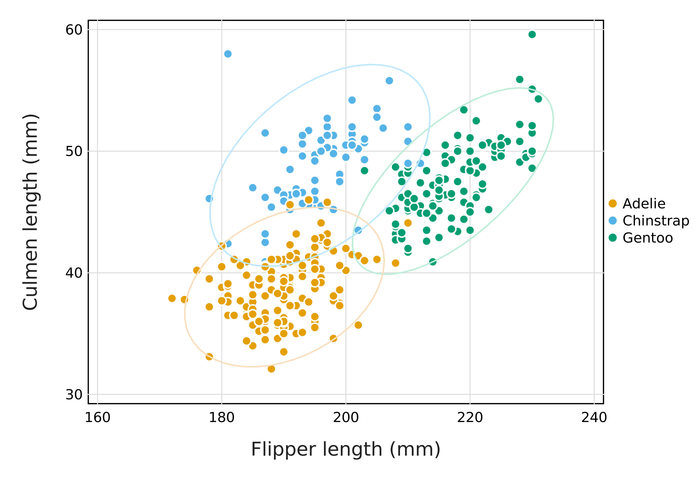
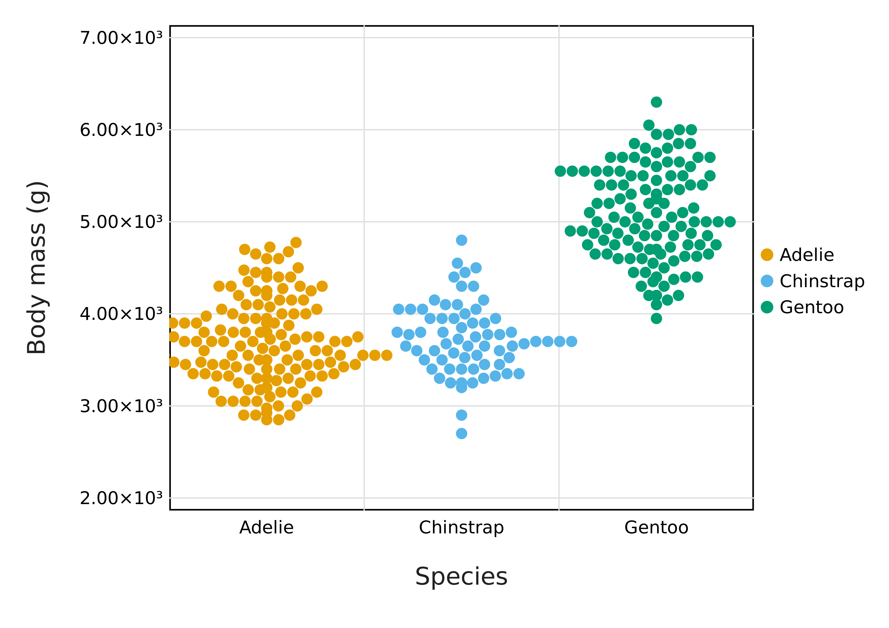
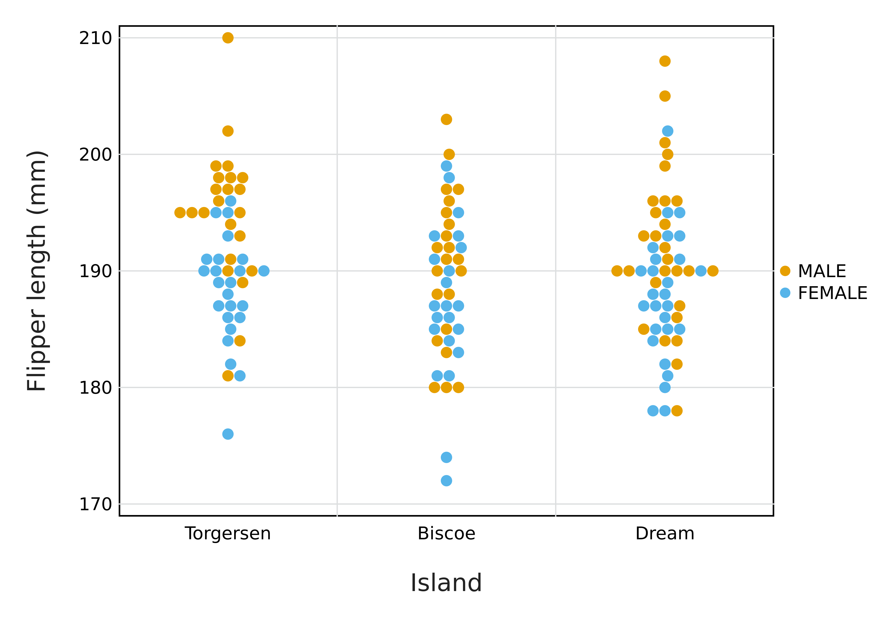

# Data Wrangling

## An introduction

---

# Class agenda

## What we will do

- Reproduce the up and coming `penguins` dataset
- Perform some exploratory data visualisation
- Trasnform and aggregate data 

--

## Why we will do it

- `iris` comes from a long tradition of eugenics in statistics
- Penguins are cool
- We will see how to manipulate data simply

---

# Setting up our environment

We need to get data from a server, then we will read the data:

```julia
import CSV
```


We will manipulate these data as data frames:

```julia
using DataFrames
using DataFramesMeta
```


We will also plot and pretty-print tables:

```julia
import Cairo, Fontconfig
using Gadfly
import Latexify
```


---

# Preparing the environment

Let's prepare a folder

```julia
penguin_path = joinpath("data", "penguins")
ispath(penguin_path) || mkpath(penguin_path)
```


We use the following construct:

```
thing we want to be true || thing to do if the first part is false
```

--

This is equivalent to 

```
if ispath("data/penguins")
    continue
else
    mkpath("data/penguins")
end
```

but a little bit shorter - we will often use this *shorthand* notation

---

# Preparing to access the data

The data all share the same URI root


```julia
uri_root = "https://portal.edirepository.org/nis/dataviewer?packageid="
```

```
"https://portal.edirepository.org/nis/dataviewer?packageid="
```


--

We can get the datasets IDs in a `Dict`:

```julia
identifiers = Dict{String,String}(
    "adelie" => "knb-lter-pal.219.3&entityid=002f3893385f710df69eeebe893144ff",
    "gentoo" => "knb-lter-pal.220.3&entityid=e03b43c924f226486f2f0ab6709d2381",
    "chinstrap" => "knb-lter-pal.221.2&entityid=fe853aa8f7a59aa84cdd3197619ef462"
    )
```


---

# Accessing the data

To save time, we will download and save the files

```julia
for entry in identifiers
    penguin, identifier = entry
    datafile = joinpath("data", "penguins", "$(penguin).csv")
    if isfile(datafile)
        continue
    else
        download(uri_root * identifier, datafile)
    end
end
```


--

We can have a look at the `data` folder:

```julia
readdir(joinpath("data", "penguins"))
```

```
3-element Vector{String}:
 "adelie.csv"
 "chinstrap.csv"
 "gentoo.csv"
```


---

# Reading the data

We are now ready to load the data.

--

First, where are they?

```julia
adelie_csv_file = joinpath("data", "penguins", "adelie.csv")
```


--

Let's read them as a a `CSV` file:

```julia
adelie_csv = CSV.File(adelie_csv_file)
```


--

And finally, let's make a `DataFrame` out of them:

```julia
adelie = DataFrame(adelie_csv)
```


---

# Reading the data (alternative one liners)

In the previous slide, we called the functions the "standard" way, where the
arguments were nested inside the function calls.

We could have written this as a single line:

```julia
adelie = DataFrame(CSV.File(joinpath("data", "penguins", "adelie.csv")))
```


--

But there is another way: using *pipes* (`|>`, which are the characters `|` and
`>`). Pipes send arguments from one function to another. We could have written
the same line in the following way:

```julia
adelie = joinpath("data", "penguins", "adelie.csv") |> CSV.File |> DataFrame
```


--

Pipes are useful if you want to emphasize the *chronology* of the code:

```julia
adelie = joinpath("data", "penguins", "adelie.csv") |>
    CSV.File |>
    DataFrame
```


---

# What do the data look like?

```julia
Latexify.latexify(adelie[1:3,1:7], latex=false, env=:mdtable)
```


| studyName | Sample Number |                             Species | Region |    Island |              Stage | Individual ID |
| ---------:| -------------:| -----------------------------------:| ------:| ---------:| ------------------:| -------------:|
|   PAL0708 |             1 | Adelie Penguin (Pygoscelis adeliae) | Anvers | Torgersen | Adult, 1 Egg Stage |          N1A1 |
|   PAL0708 |             2 | Adelie Penguin (Pygoscelis adeliae) | Anvers | Torgersen | Adult, 1 Egg Stage |          N1A2 |
|   PAL0708 |             3 | Adelie Penguin (Pygoscelis adeliae) | Anvers | Torgersen | Adult, 1 Egg Stage |          N2A1 |


--

There is a lot of information we will *not* want to keep! In the next step, we
will remove a large part of it. Note that the column names have both spaces and
metadata, which is not good practices.

---

# Columns selection

We will start by selecting the columns we care about (after a bit of manual
inspection).

```julia
colnames = [
    "Species", "Region", "Island", "Culmen Length (mm)", "Culmen Depth (mm)",
    "Flipper Length (mm)", "Body Mass (g)", "Sex"
]
select!(adelie, Symbol.(colnames))
Latexify.latexify(adelie[1:5,1:5], latex=false, env=:mdtable)
```


|                             Species | Region |    Island | Culmen Length (mm) | Culmen Depth (mm) |
| -----------------------------------:| ------:| ---------:| ------------------:| -----------------:|
| Adelie Penguin (Pygoscelis adeliae) | Anvers | Torgersen |               39.1 |              18.7 |
| Adelie Penguin (Pygoscelis adeliae) | Anvers | Torgersen |               39.5 |              17.4 |
| Adelie Penguin (Pygoscelis adeliae) | Anvers | Torgersen |               40.3 |              18.0 |
| Adelie Penguin (Pygoscelis adeliae) | Anvers | Torgersen |            missing |           missing |
| Adelie Penguin (Pygoscelis adeliae) | Anvers | Torgersen |               36.7 |              19.3 |


---

# Columns renaming

We will give the columns better name for data manipulation: lowercase, no
spaces, no metadata.

```julia
renames = [
    "Species" => "species", "Region" => "region", "Island" => "island", 
    "Culmen Length (mm)" => "culmen_length", "Culmen Depth (mm)" => "culmen_depth",
    "Flipper Length (mm)" => "flipper_length", "Body Mass (g)" => "bodymass",
    "Sex" => "sex"
]
rename!(adelie, renames...)
adelie.species .= "Adelie"
Latexify.latexify(first(adelie, 4), latex=false, env=:mdtable)
```


| species | region |    island | culmen_length | culmen_depth | flipper_length | bodymass |     sex |
| -------:| ------:| ---------:| -------------:| ------------:| --------------:| --------:| -------:|
|  Adelie | Anvers | Torgersen |          39.1 |         18.7 |            181 |     3750 |    MALE |
|  Adelie | Anvers | Torgersen |          39.5 |         17.4 |            186 |     3800 |  FEMALE |
|  Adelie | Anvers | Torgersen |          40.3 |         18.0 |            195 |     3250 |  FEMALE |
|  Adelie | Anvers | Torgersen |       missing |      missing |        missing |  missing | missing |


---

# Merging the three datasets

```julia
function clean_penguin_df(species::AbstractString)
    df = DataFrame(CSV.File(joinpath("data", "penguins", lowercase(species)*".csv")))
    select!(df, Symbol.(colnames))
    rename!(df, renames...)
    df.species .= species
    return df
end
```


--

We can now `map` this function for the three species, and the concatenate the
results:

```julia
penguins = vcat(clean_penguin_df.(["Adelie", "Chinstrap", "Gentoo"])...)
Latexify.latexify(first(penguins, 3), latex=false, env=:mdtable)
```


| species | region |    island | culmen_length | culmen_depth | flipper_length | bodymass |    sex |
| -------:| ------:| ---------:| -------------:| ------------:| --------------:| --------:| ------:|
|  Adelie | Anvers | Torgersen |          39.1 |         18.7 |            181 |     3750 |   MALE |
|  Adelie | Anvers | Torgersen |          39.5 |         17.4 |            186 |     3800 | FEMALE |
|  Adelie | Anvers | Torgersen |          40.3 |         18.0 |            195 |     3250 | FEMALE |


---

# Saving the artifacts!

We have done a lot of work we do *not* want to lose:

```julia
CSV.write(joinpath("data", "penguins.csv"), penguins)
```

```
"data/penguins.csv"
```


--

We will call a *[computational artifact][artifact]* anything that is written to
disk:

- intermediate files
- scripts
- figures

[artifact]: https://plato.stanford.edu/entries/computer-science/

---

# Taking a step back

So far, we have

- **read** data from a remote machine   
`download`
--

- **loaded** these data from the disk to memory   
`CSV.File`, `DataFrame`
--

- **cleaned** a data file to decide what to keep   
`rename!`, `select!`
--

- **applied** the cleaning to the entire dataset   
`.` , `vcat`
--

- **saved** the dataset we will actually use to disk   
`CSV.Write`

---

class: split-50

# Looking at relationships

.column[
```julia
plot(
    dropmissing(penguins),
    x=:flipper_length,
    y=:culmen_length,
    color=:species,
    Geom.ellipse, Geom.point,
    Guide.xlabel("Flipper length (mm)"),
    Guide.ylabel("Culmen length (mm)")
) |>
PNG("figures/data_ellipses.png", dpi=600)
```


]


.column[

]

---

class: split-50

# Looking at distributions

.column[
```julia
plot(
    dropmissing(
        select(
        penguins,
        [:species, :bodymass]
        )
    ),
    x=:species,
    y=:bodymass,
    color=:species,
    Geom.beeswarm,
    Guide.xlabel("Species"),
    Guide.ylabel("Body mass (g)")
) |>
PNG("figures/data_distributions.png", dpi=600)
```


]

.column[

]

---

# Data aggregation

```julia
using Statistics
avg_bodymass = @linq penguins |> 
    select(:species, :island, :bodymass) |>
    where(.!ismissing.(:bodymass)) |>
    by([:species, :island], mean = mean(:bodymass), std = std(:bodymass)) |>
    orderby(:mean)

Latexify.latexify(avg_bodymass, latex=false, env=:mdtable, fmt="%.2d")
```


|   species |    island | mean | std |
| ---------:| ---------:| ----:| ---:|
|    Adelie |     Dream | 3688 | 455 |
|    Adelie | Torgersen | 3706 | 445 |
|    Adelie |    Biscoe | 3710 | 488 |
| Chinstrap |     Dream | 3733 | 384 |
|    Gentoo |    Biscoe | 5076 | 504 |


---

# The grammar of data

| Semantics | Julia (*DataFramesMeta*) | R (*dplyr*) |
|----|----|----|
| Selecting data | `@where` | `filter` |
| Transforming data | `@transform` | `mutate` |
| Grouping and summarizing | `@by` | `group_by` |
| Sorting rows | `@orderby` | `arrange` |
| Selecting columns | `@select` | `select` |

--

**Note that** this assumes that the data are *wide*, *i.e.* each observation is
a row, and each variable is a column.

---

# Let's mess some data up!

The `penguins` dataset is in the *wide* format, which has each observation in
its own row. We can transform it to the *long* format using `stack`:

```julia
stack(penguins, [:culmen_length, :culmen_depth, :flipper_length, :bodymass]) |>
    df -> Latexify.latexify(df[1:7,:], latex=false, env=:mdtable, fmt="%.2d")
```


| species | region |    island |     sex |      variable |   value |
| -------:| ------:| ---------:| -------:| -------------:| -------:|
|  Adelie | Anvers | Torgersen |    MALE | culmen_length |      39 |
|  Adelie | Anvers | Torgersen |  FEMALE | culmen_length |      40 |
|  Adelie | Anvers | Torgersen |  FEMALE | culmen_length |      40 |
|  Adelie | Anvers | Torgersen | missing | culmen_length | missing |
|  Adelie | Anvers | Torgersen |  FEMALE | culmen_length |      37 |
|  Adelie | Anvers | Torgersen |    MALE | culmen_length |      39 |
|  Adelie | Anvers | Torgersen |  FEMALE | culmen_length |      39 |


---

# Is the process reversible?

In the previous example, we *cannot* get back from the long data to the wide
one, because **observations have no identifiers**.

If we have to, we can define three types of identifiers:

--

**Index-based**: `1 2 3 4 ...`

--

**Semantics-based**: `ISLAND_species_number`

--

**Universally unique identifiers:**

```julia
using UUIDs #Part of the standard library
[uuid4() for i in 1:4]
```

```
4-element Vector{Base.UUID}:
 UUID("b708d3a9-668f-4c66-a817-115f076c502e")
 UUID("4564bed3-440e-4e20-83fb-7b618a2be897")
 UUID("c5cd56c4-d4b3-4e4a-a249-663bd286b9c3")
 UUID("51fb5dea-ee0d-4e9f-bb79-dcb323d84244")
```


---

# Counting penguins

Let's write a pipeline to count the number of individuals (by sex) of each
species on each island, and only retain the combinations with more than 20
samples where all measurements are available:

--

```julia
@linq dropmissing(penguins) |>
    select(:island, :species, :sex) |>
    by([:island, :species, :sex], count = length(:species)) |>
    where(:count .>= 20) |>
    orderby(:count)
```

```
10×4 DataFrame
 Row │ island     species    sex     count
     │ String     String     String  Int64
─────┼─────────────────────────────────────
   1 │ Biscoe     Adelie     FEMALE     22
   2 │ Biscoe     Adelie     MALE       22
   3 │ Torgersen  Adelie     MALE       23
   4 │ Torgersen  Adelie     FEMALE     24
   5 │ Dream      Adelie     FEMALE     27
   6 │ Dream      Adelie     MALE       28
   7 │ Dream      Chinstrap  FEMALE     34
   8 │ Dream      Chinstrap  MALE       34
   9 │ Biscoe     Gentoo     FEMALE     58
  10 │ Biscoe     Gentoo     MALE       61
```


---

class: split-50

# Difference in flipper size across islands?


.column[
```julia
tdf = @linq dropmissing(penguins) |>
    where(:species .== "Adelie") |>
    select(:island, :sex, :flipper_length)

plot(
    tdf,
    x=:island,
    y=:flipper_length,
    color=:sex,
    Geom.beeswarm,
    Guide.xlabel("Island"),
    Guide.ylabel("Flipper length (mm)")
) |>
PNG("figures/data_islands.png", dpi=600)
```


]

.column[

]