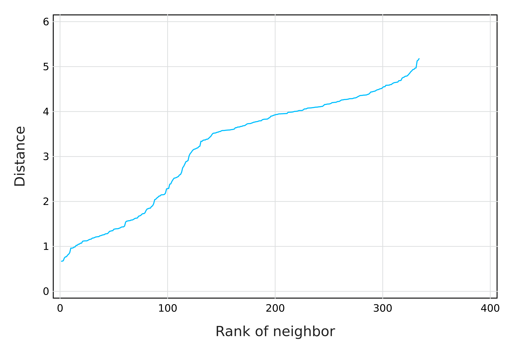
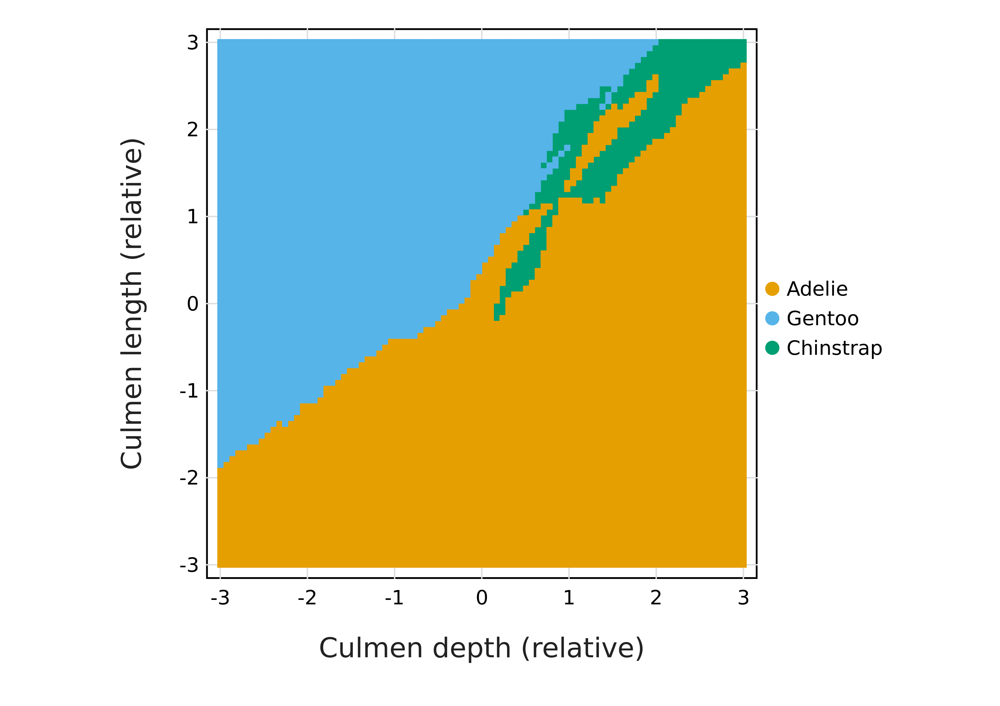

# k-Nearest Neighbors from scratch

## That's not my penguin!

---

# Class agenda

## What we will do

- Write a $k$-NN function *from scratch*
- Use it to make predictions
- Start thinking about validation

--

## Why we will do it

- $k$-NN is a nice way to understand how *Julia* works
- It's a very intuitive algorithm
- It often works quite well!

---

# Setting up the environment

We will not need a lot more than for the previous module:

```julia
using DataFrames, DataFramesMeta
import CSV
import Cairo, Fontconfig
using Gadfly
```


To simplify our work, we will add the `StatsBase` package, which will make the
code nicer to write:

```julia
using Statistics
using StatsBase
```


---

# Loading the data

We will get the `penguins` data from the previous module -- as a reminder, we
can load them using *pipes*:

```julia
penguins = 
    joinpath("data", "penguins.csv") |>
    CSV.File |>
    DataFrame |>
    dropmissing
```


Note that we add `dropmissing` (about 10 records) to avoid having to deal with
the issue of `Missing` data (for now).

---

class: split-40

# That's not my penguin!

.column[

]

.column[But how do we know if this is, in fact, our penguin?

How can we compare a penguin to other individuals?

Can we find out to which group any arbitrary penguin belongs?

**Yes**! Using $k$-NN.]

---

class: split-50

# OK so... what is k-NN anyways?

.column[
- A **non-parametric** method for **classification** and **regression**
- The **class membership** or **property value** for an unknown point (*object*) is based on the properties of its neighbors
- The **nearest neighbors** of a point (*instance*) are based on distance between values (*features*)
- The final decision follows a (more or less complex) **voting system**
]

--

.column[
- $k$-NN needs **no training**
- $k$ is an **hyper-parameter**, which makes the process more or less sensitive to data noise
- Because $k$-NN relies on *distances between points*, measurements in different units shouts be standardized
]

---

# Working our way through the terminology

The data we will use for this module is going to be the *four quantitative
measurements* from `penguins`. The first step will be to convert them into a
matrix of **features**:

```julia
features = permutedims(Matrix(penguins[!,[:culmen_depth, :culmen_length, :flipper_length, :bodymass]]))
```

```
4×334 Matrix{Float64}:
   18.7    17.4    18.0    19.3    20.6  …    14.3    15.7    14.8    16.1
   39.1    39.5    40.3    36.7    39.3       46.8    50.4    45.2    49.9
  181.0   186.0   195.0   193.0   190.0      215.0   222.0   212.0   213.0
 3750.0  3800.0  3250.0  3450.0  3650.0     4850.0  5750.0  5200.0  5400.0
```


Every *row* is a **feature**, and every *column* is an **instance**. This is a
convention: we deal with features as vectors, and **V**ectors are **V**ertical.

The vector of features for the first instance is:

$$
v_1 = [18.7, 39.1, 181.0, 3750.0]^T
$$

---

class: split-50

# Transforming the data

The data are not expressed in the same unit - we will apply a simple $z$-score
transformation.


.column[
```julia
μ = vec(mean(features, dims=2))
```

```
4-element Vector{Float64}:
   17.160479041916172
   43.99431137724552
  201.01497005988023
 4209.056886227545
```


]

.column[
```julia
σ = vec(std(features, dims=2))
```

```
4-element Vector{Float64}:
   1.9679094587143935
   5.460521483312747
  14.022175182401188
 804.836129253923
```


]

--

We can now work on the version of the data where every features as mean 0 and
unit standard deviation:

```julia
nf = (features .- μ)./σ
```

```
4×334 Matrix{Float64}:
  0.782313   0.121713   0.426605  …  -0.742147  -1.19949   -0.538886
 -0.896308  -0.823055  -0.676549      1.17309    0.220801   1.08152
 -1.42738   -1.0708    -0.428961      1.49656    0.783404   0.85472
 -0.570373  -0.508249  -1.19162       1.9146     1.23124    1.47973
```


---

class: split-30

# But how does k-NN *works*?

.column[
- Get measurements for an object with **unknwon membership**
- Find out which $k$ known instances have the **closest features**
- Take a **majority consensus** of the class of the neighbors
]

--

.column[
If we have measured the following penguin:

```julia
pingoo = [12.4, 46.7, 215.3, 4842.0]
```


what is its species, knowing all the data we already have?

This will require a **data transformation** to express the measurements (in
biological units) in the unitless **features space**:

```julia
nd = (pingoo .- μ)./σ
```


$$
v_\text{pingoo} = [-2.42, 0.5, 1.02, 0.79]^T
$$

]

---

class: split-50

# Measuring the distances

.column[
We can very easily use the Euclidean distance:

```julia
distances = vec(sqrt.(sum((nf .- nd).^2.0; dims=1)))
```


Let's also plot it to look at the distribution:

```julia
plot(
    y = sort(distances),
    Geom.line,
    Guide.xlabel("Rank of neighbor"),
    Guide.ylabel("Distance")
) |> PNG("figures/knndist.png", dpi=600)
```


Note that $k$-NN does not require to set a *distance* cutoff (so we don't care
too much about the distance distribution)!
]

.column[

]

---

# Getting the class membership of neighbors

We can use `sortperm` to return a *sorted ordering* of the distance vector, and
then use `findall` to get the position of the distances that are the $k$
smallest:

```julia
k = 5
neighbors = findall(sortperm(distances) .<= k)
neighbors'
```

```
1×5 adjoint(::Vector{Int64}) with eltype Int64:
 182  201  294  308  330
```


Because we know where the **labels** are stored (`penguins.species`), we can get
the pool of possible species for our object:

```julia
penguins.species[neighbors]
```

```
5-element PooledArrays.PooledVector{String, UInt32, Vector{UInt32}}:
 "Chinstrap"
 "Chinstrap"
 "Gentoo"
 "Gentoo"
 "Gentoo"
```


---

# Assigning our penguin to a class

Voting is, at this point, as simple as counting the number of times any species
was recommended:

```julia
votes = countmap(penguins.species[neighbors])
```

```
Dict{String, Int64} with 2 entries:
  "Gentoo"    => 3
  "Chinstrap" => 2
```


We can use some basic `sort`ing of the votes to get the most likely species for
the sample:

```julia
first(sort(collect(votes), by = (x) -> x.second, rev=true)).first
```

```
"Gentoo"
```


---

# The "landscape" of k-NN predictions

We will assume that we know of *two* values, and ignore two others:


```julia
ftval = LinRange(-2, 2, 50)
ftcomb = vec(collect(Base.product(ftval, ftval)))
decisions = []
for (f1, f2) in ftcomb
    tv = [f1, f2, 0.0, 0.0]
    distances = vec(sqrt.(sum((nf .- tv).^2.0; dims=1)))
    neighbors = findall(sortperm(distances) .<= 5)
    votes = countmap(penguins.species[neighbors])
    decision = first(sort(collect(votes), by = (x) -> x.second, rev=true)).first
    push!(decisions, decision)
end
```


---

class: split-50

# Visualizing the predictions (k=5)

.column[
```julia
f1 = [first(c) for c in ftcomb]
f2 = [last(c) for c in ftcomb]
plot(
    x = f1, y = f2,
    color=decisions,
    Geom.rectbin,
    Guide.xlabel("Culmen depth (relative)"),
    Guide.ylabel("Culmen length (relative)"),
    Coord.cartesian(
        xmin=-2, xmax=2, ymin=-2, ymax=2, fixed=true
    )
) |> PNG("figures/knnsim.png", dpi=600)
```


]

.column[

]
