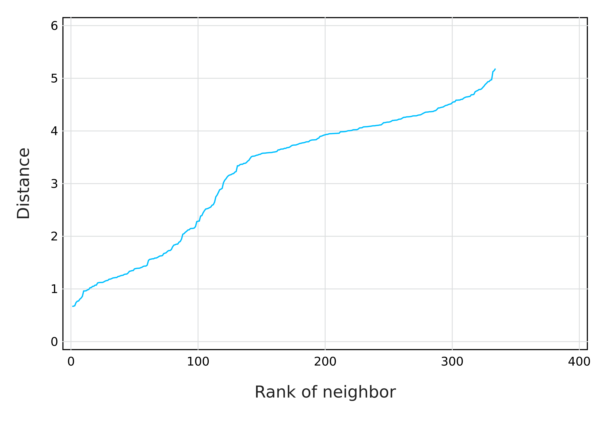
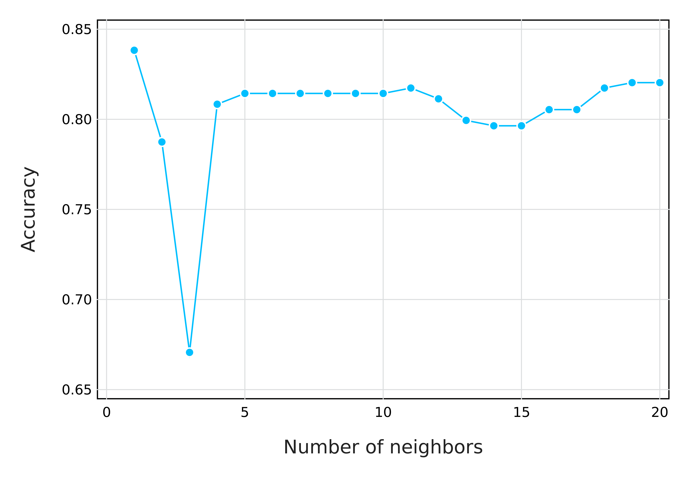

# Optimizing features

## PCA and all that

---

# Class agenda

## What we will do

- Apply some transformation on the penguins dataset
- Discuss the difference between PCA in ecology and machine learning
- See the effect of feature transformation on model performance

--

## Why we will do it

- Very few features are directly usable
- Models usually work best when we correct for statistical artifacts
- It's (sometimes) a good way to have fewer dimensions

---

# Setting up the environment

We will not need a lot more than for the previous module:

```julia
using DataFrames, DataFramesMeta
import CSV
import Cairo, Fontconfig
using Gadfly
```


We will add the `MultivariateStats` and `DecisionTree` packages to help.

```julia
using Statistics
using StatsBase
using MultivariateStats
using DecisionTree
```


---

# Loading the data

We will get the `penguins` data from the previous module -- as a reminder, we
can load them using *pipes*:

```julia
penguins = 
    joinpath("data", "penguins.csv") |>
    CSV.File |>
    DataFrame |>
    dropmissing
```


Note that we add `dropmissing` (about 10 records) to avoid having to deal with
the issue of `Missing` data (for now).

```julia
features = permutedims(Matrix(penguins[!,[:culmen_depth, :culmen_length, :flipper_length, :bodymass]]))
labels = penguins.species
```


---

# Training and testing

We will split our dataset into a training and testing set.

```julia
test_index = sample(1:length(labels), 50, replace=false)
train_index = filter(i -> !(i in test_index), 1:length(labels))
```


To avoid having too many variables, we will carry the test/train
features/labels together in tuples:

```julia
# DecisionTree follows the 'wrong' convention for features...
testset = (features[:,test_index]', vec(labels[test_index]))
trainset = (features[:,train_index]', vec(labels[train_index]))
```

```
([18.7 39.1 181.0 3750.0; 18.0 40.3 195.0 3250.0; … ; 14.8 45.2 212.0 5200.
0; 16.1 49.9 213.0 5400.0], ["Adelie", "Adelie", "Adelie", "Adelie", "Adeli
e", "Adelie", "Adelie", "Adelie", "Adelie", "Adelie"  …  "Gentoo", "Gentoo"
, "Gentoo", "Gentoo", "Gentoo", "Gentoo", "Gentoo", "Gentoo", "Gentoo", "Ge
ntoo"])
```


---

class: split-50

# A baseline model

We will use a regression tree (using CART, from `DecisionTree`) to classify
penguins based on features:

.column[
```julia
model = build_tree(reverse(trainset)...)
model = prune_tree(model, 0.9)
print_tree(model, 3)
```

```
Feature 3, Threshold 206.5
L-> Feature 2, Threshold 44.650000000000006
    L-> Feature 2, Threshold 42.4
        L-> Adelie : 112/113
        R-> 
    R-> Feature 4, Threshold 4125.0
        L-> Chinstrap : 43/43
        R-> 
R-> Feature 1, Threshold 18.1
    L-> Gentoo : 103/103
    R-> Feature 1, Threshold 18.95
        L-> Adelie : 1/1
        R-> Chinstrap : 5/5
```


]

.column[
```julia
prediction = apply_tree(model, first(testset))
confusion_matrix(last(testset), prediction)
```

```
3×3 Matrix{Int64}:
 23  1   1
  0  9   0
  0  0  16
Classes:  ["Adelie", "Chinstrap", "Gentoo"]
Matrix:   
Accuracy: 0.96
Kappa:    0.9360204734484964
```


]

---

class: split-50

# Centering and Standardizing

The data are not expressed in the same unit - we will apply a simple $z$-score
transformation, as we did with our bespoke $k$-NN:

.column[
```julia
# We need to express these as row vectors
mn = vec(mean(features, dims=2))'
st = vec(std(features, dims=2))'
```

```
1×4 adjoint(::Vector{Float64}) with eltype Float64:
 1.96791  5.46052  14.0222  804.836
```


]

.column[
```julia
model = build_tree(last(trainset), (first(trainset).-mn)./st)
model = prune_tree(model, 0.9)
prediction = apply_tree(model, (first(testset).-mn)./st)
confusion_matrix(last(testset), prediction)
```

```
3×3 Matrix{Int64}:
 24  0   1
  1  8   0
  0  0  16
Classes:  ["Adelie", "Chinstrap", "Gentoo"]
Matrix:   
Accuracy: 0.96
Kappa:    0.9346832135858916
```


]

---

# Centering and Standardizing - discussion

- There is not a great difference in performance
- Why?

---

class: split-30

# But how does k-NN *works*?

.column[
- Get measurements for an object with **unknwon membership**
- Find out which $k$ known instances have the **closest features**
- Take a **majority consensus** of the class of the neighbors
]

--

.column[
If we have measured the following penguin:

```julia
pingoo = [12.4, 46.7, 215.3, 4842.0]
```


what is its species, knowing all the data we already have?

This will require a **data transformation** to express the measurements (in
biological units) in the unitless **features space**:

```julia
nd = (pingoo .- μ)./σ
```


$$
v_\text{pingoo} = [Error: UndefVarError: nd not defined, Error: UndefVarError: nd not defined, Error: UndefVarError: nd not defined, Error: UndefVarError: nd not defined]^T
$$

]

---

class: split-50

# Measuring the distances

.column[
We can very easily use the Euclidean distance:

```julia
distances = vec(sqrt.(sum((nf .- nd).^2.0; dims=1)))
```


Let's also plot it to look at the distribution:

```julia
plot(
    y = sort(distances),
    Geom.line,
    Guide.xlabel("Rank of neighbor"),
    Guide.ylabel("Distance")
) |> PNG("figures/knndist.png", dpi=600)
```

```
Error: UndefVarError: distances not defined
```


Note that $k$-NN does not require to set a *distance* cutoff (so we don't care
too much about the distance distribution)!
]

.column[

]

---

# Getting the class membership of neighbors

We can use `sortperm` to return a *sorted ordering* of the distance vector, and
then use `findall` to get the position of the distances that are the $k$
smallest:

```julia
k = 5
neighbors = findall(sortperm(distances) .<= k)
neighbors'
```

```
Error: UndefVarError: distances not defined
```


Because we know where the **labels** are stored (`penguins.species`), we can get
the pool of possible species for our object:

```julia
penguins.species[neighbors]
```

```
Error: UndefVarError: neighbors not defined
```


---

# Assigning our penguin to a class

Voting is, at this point, as simple as counting the number of times any species
was recommended:

```julia
votes = countmap(penguins.species[neighbors])
```

```
Error: UndefVarError: neighbors not defined
```


We can use some basic `sort`ing of the votes to get the most likely species for
the sample:

```julia
first(sort(collect(votes), by = (x) -> x.second, rev=true)).first
```

```
Error: UndefVarError: votes not defined
```


---

# The "landscape" of k-NN predictions

We will assume that we know of *two* values, and ignore two others:


```julia
ftval = LinRange(-3, 3, 90)
ftcomb = vec(collect(Base.product(ftval, ftval)))
decisions = []
for (f1, f2) in ftcomb
    tv = [f1, f2, 0.0, 0.0]
    distances = vec(sqrt.(sum((nf .- tv).^2.0; dims=1)))
    neighbors = findall(sortperm(distances) .<= 5)
    votes = countmap(penguins.species[neighbors])
    decision = first(sort(collect(votes), by = (x) -> x.second, rev=true)).first
    push!(decisions, decision)
end
```

```
Error: UndefVarError: nf not defined
```


---

class: split-50

# Visualizing the predictions (k=5)

.column[
```julia
f1 = [first(c) for c in ftcomb]
f2 = [last(c) for c in ftcomb]
plot(
    x = f1, y = f2,
    color=decisions,
    Geom.rectbin,
    Guide.xlabel("Culmen depth (relative)"),
    Guide.ylabel("Culmen length (relative)"),
    Coord.cartesian(
        xmin=-3, xmax=3, ymin=-3, ymax=3, fixed=true
    )
) |> PNG("figures/knnsim.png", dpi=600)
```

```
Error: MethodError: no method matching iterate(::Nothing)
Closest candidates are:
  iterate(!Matched::Union{LinRange, StepRangeLen}) at range.jl:664
  iterate(!Matched::Union{LinRange, StepRangeLen}, !Matched::Int64) at rang
e.jl:664
  iterate(!Matched::T) where T<:Union{Base.KeySet{var"#s79", var"#s78"} whe
re {var"#s79", var"#s78"<:Dict}, Base.ValueIterator{var"#s77"} where var"#s
77"<:Dict} at dict.jl:693
  ...
```


]

.column[

]

---

# Intermezzo: turning k-NN into a function

```julia
function knn(v::Vector{TF}, features::Matrix{TF}, labels::Vector{TL}; k::Integer=5) where {TF <: Number, TL}
    @assert length(v) == size(features, 1)
    @assert length(labels) == size(features, 2)
    @assert 1 <= k <= length(labels)

    Δ = vec(sqrt.(sum((v .- features).^2.0; dims=1)))

    neighbors = findall(sortperm(Δ) .<= k)
    votes = countmap(labels[neighbors])
    decision = first(sort(collect(votes), by = (x) -> x.second, rev=true)).first

    return decision
end
```


```julia
labels = vec(String.(penguins.species))
features = nf
```


---

# Cross validation

We want to **evaluate** the model on data it **has not seen before**. We call
this **cross-validation**.

--

**Holdout**: the dataset is split in two (training and testing), and we measure
the performance by applying to the model on the testing set, but only informing
it of the training set.

--

**K-fold**: we divide the dataset in $K$ samples, train it on
$K-1$, and evaluate on the remaining one.

--

**Leave-One-Out**: we apply K-fold validation, where $K = n-1$, so that *every
single object* in the dataset is evaluated as a testing set.

---

# Measuring accuracy

One important decision to make when evaluating a model is to decide *which
function is used to measure its performance*.

We will see a lot more when working on binary classifiers.

For the moment, let's have a look at the accurracy function: the proportion of
correct guesses.

--

```julia
function accuracy(x::Vector{T}, y::Vector{T}) where {T}
    @assert length(x) == length(y)
    return sum(x .== y)/length(x)
end
```


---

# Leave-One-Out cross validation

```julia
guesses = similar(labels)

function loocv!(guesses, features, labels; k=3)
    for i in 1:size(features, 2)
        tf = features[:, setdiff(1:end, i)]
        tl = labels[setdiff(1:end, i)]
        guesses[i] = knn(vec(features[:,i]), tf, tl; k=k)
    end
    return accuracy(guesses, labels)
end

function loocv(features, labels; k=3)
    guesses = similar(labels)
    return loocv!(guesses, features, labels; k=k)
end

loocv!(guesses, features, labels)
```

```
0.6497005988023952
```


---

class: split-50

# Can we find the "best" k?

.column[
```julia
K = collect(1:20)

acc = [
    loocv!(
        guesses, features, labels; k=k
    ) for k in K
]

plot(
    x = K, y = acc,
    Geom.point,
    Geom.line,
    Guide.xlabel("Number of neighbors"),
    Guide.ylabel("Accuracy"),
) |> PNG("figures/knnloo.png", dpi=600)
```


]

.column[

]
